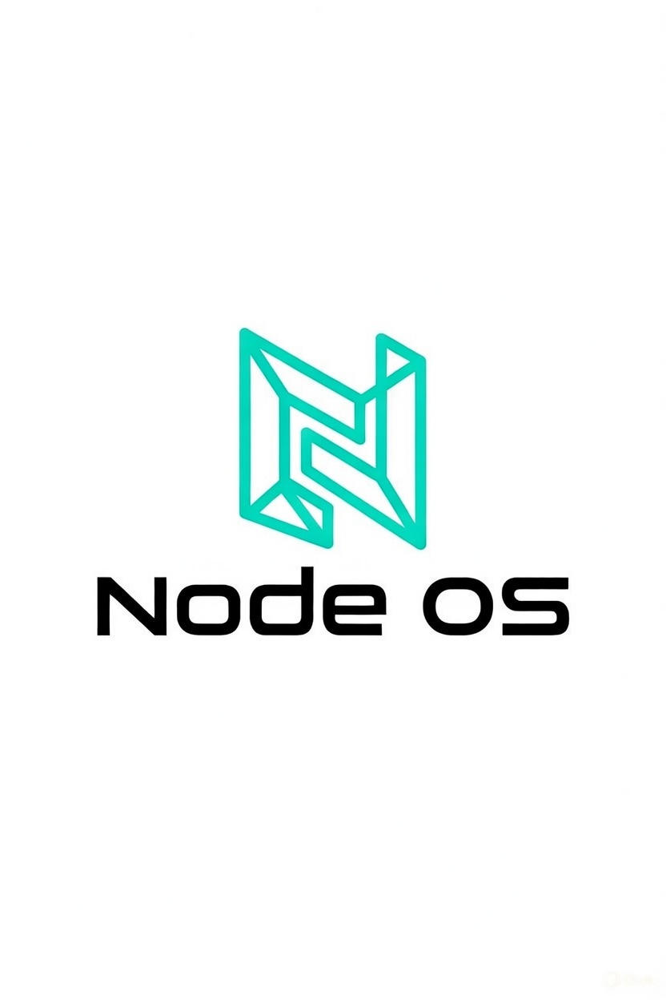

# NODE-OS-VITE
Final Protoype for DEMO of NODE|OS / ALLMIND 

BETA : IN DEVELOPMENT
 
  <>
 ---
 
 # **NODE OS — The Zero-Install, Ephemeral Application Operating System**
 
 **15 KB total footprint. Pure DOM. URL-native apps. Deterministic logic.**
 
 NODE OS is a micro-operating environment designed to run applications directly from URLs with **zero installation**, **zero native dependencies**, and **near-zero energy overhead**.
 It functions as an ultra-lightweight OS layer that turns any browser-capable device into an application host using:
 
 * **Ephemeral execution** (apps do not live on disk)
 * **A private, embedded JavaScript reactor**
 * **Pure DOM rendering (no WebView shells, no Electron, no Tauri, no bundling)**
 * **A universal blueprint → runtime pipeline**
 * **Optional ZetaMorph deterministic logic gates**
 
 NODE OS is not a framework, not a desktop-in-a-browser, and not a virtual machine.
 It is a **minimal OS runtime** whose only job is to:
 
 1. **Spawn** an app from a remote hub
 2. **Map** its logic and UI into a safe, private reactor
 3. **Render** the app entirely in the DOM
 4. **Destroy** the app cleanly on exit
 
 The result:
 A completely new model of software distribution where **apps behave like fluid, ephemeral objects** rather than installed binaries.
 
 ---
 
 # **Why NODE OS Exists**
 
 Modern application stacks suffer from massive redundancy:
 
 * 10 devices × 10 GB of apps = **100 GB of redundant data**
 * Every device stores the same binaries
 * Every update requires re-installing the entire package
 * Every runtime ships its own copy of Node/Chromium/Rust libs
 
 NODE OS collapses this model:
 
 * All apps live on the **Hub**
 * Devices store **0 copies**
 * The OS stays under **15 KB**
 * App launch = load a blueprint + JS logic dynamically
 * Perfect for multi-device, low-power, edge, and IoT environments
 
 It is both technically smaller **and conceptually tighter** than Electron, Tauri, Wails, or web desktops.
 
 ---
 
 # **How NODE OS Works (Technical Summary)**
 
 NODE OS uses a three-part execution framework:
 
 ### **1. Hub App Blueprint**
 
 Each app provides:
 
 * A URL to a JS module
 * A component name (DOM render function or React component)
 * Optional metadata and permissions
 
 ### **2. The Reactor**
 
 A private JS environment that:
 
 * Fetches the app script dynamically
 * Waits for a ready signal
 * Mounts the app into a fresh DOM container
 * Provides simple lifecycle helpers (spawn, destroy, wire, label)
 
 Reactor example (simplified):
 
 ```js
 const script = document.createElement('script');
 script.src = hubURL + "?t=" + Date.now();
 
 script.onload = () => {
     const Skin = window[componentName];
     const container = document.createElement('div');
     document.body.appendChild(container);
     createRoot(container).render(<Skin />);
 };
 ```
 
 No bundlers.
 No build step.
 No local filesystem.
 Just “URL = application.”
 
 ### **3. ZetaMorph (Optional Logic Layer)**
 
 A deterministic, CPU-minimal logic gate system designed for:
 
 * Math
 * State transitions
 * Small symbolic chains
 * Input → intent → output processes
 
 ZetaMorph runs entirely **in RAM** using ephemeral state objects.
 It offloads simple logic away from the CPU by using predictable symbolic transitions rather than dynamic compute cycles.
 
 It is not mystical.
 It is a **formalized state machine** built for:
 
 * Wallets
 * Secure forms
 * Calculators
 * Deterministic workflows
 * Low-energy devices
 
 This allows apps to behave like mathematical rules rather than heavy compute programs.
 
 ---
 
 # **Key Features**
 
 ### **Ultra-Lightweight OS**
 
 * 15 KB runtime
 * No native dependencies
 * Single HTML file bootstraps the entire system
 
 ### **Zero-Install Apps**
 
 * Spawn from any URL
 * Leave no footprint
 * No binary duplication
 
 ### **Ephemeral Execution**
 
 * Apps load into memory
 * Destroy cleanly on exit
 * Perfect for shared, low-power, or kiosk-style devices
 
 ### **Hub-Native**
 
 * All apps live in one central place
 * Devices never store copies
 * Update once → every device immediately gets the update
 
 ### **Simple Logic Ports**
 
 * Input Gate
 * Intent Gate
 * Output Gate
 * Exported “wires and labels” for app-to-app communication
 
 ### **Secure Surface Area**
 
 * No OS-level file access
 * No arbitrary native calls
 * Pure DOM = extremely tight security footprint
 
 ---
 
 # **Why This Model Works**
 
 Traditional
 
 * OS stores apps
 * Apps ship runtimes
 * Devices duplicate everything
 
 NODE OS
 
 * OS stores nothing
 * Hub stores everything
 * Apps are treated as **streams**, not files
 
 This eliminates:
 
 * 99% of redundant storage
 * 80% of update overhead
 * Nearly all native security risk
 * Most background CPU usage
 * Energy waste from resident app frameworks
 
 This is especially impactful for:
 
 * IoT
 * Edge devices
 * Low-power tablets / schools / developing regions
 * Multi-device households
 * Enterprise rollouts
 * Lightweight client terminals
 
 ---
 
 # **Project Roadmap (2025)**
 
 ### **Phase 1 — Core Runtime (Current)**
 
 * [x] DOM-based OS shell
 * [x] App hub loading
 * [x] Ephemeral app mount/unmount
 * [x] Private reactor environment
 
 ### **Phase 2 — ZetaMorph Integration**
 
 * [x] Input/intent/output gates
 * [x] State chain interpreter
 * [x] Deterministic math module
 * [ ] Exportable wires & labels
 
 ### **Phase 3 — Core Apps**
 
 * [x] Calculator (ZetaMorph-driven)
 * [ ] Notes app
 * [ ] File-less clipboard
 * [ ] Layout manager
 
 ### **Phase 4 — Developer Tools**
 
 * [ ] App blueprint spec (JSON)
 * [ ] Live hub registry
 * [ ] Template apps (React + DOM)
 * [ ] CLI generator (optional)
 
 ### **Phase 5 — Distribution**
 
 * [x] Public Hub
 * [ ] Example ecosystem apps
 * [ ] Node OS Showcase (landing page)
 
 ---
 
 # **Philosophy**
 
 NODE OS is built on four principles:
 
 1. **Small is stable**
 2. **Ephemeral is secure**
 3. **State is clearer than computation**
 4. **Apps should behave like URLs, not binaries software streaming**
 
 This is not a “browser OS”
 and not a “JavaScript Linux.”
 It is a **microscopic operating layer** that allows the web to behave like a native application system — without the baggage.
 
 ---
 
 # **Getting Started**
 
 ### Clone
 
 ```bash
 git clone https://github.com/LEXICALALCHEMIST/node-os
 cd node-os
 ```
 
 ### Run
 
 Open `index.html` in any browser.
 That’s it.
 
 ### Spawn an app
 
 Use the internal launcher or call:
 
 ```js
 spawnApp("calculator");
 ```
 
 ---
 
 # **Contribution**
 
 Contributions are welcome — especially from developers interested in:
 
 * Ultra-lightweight systems
 * Symbolic logic engines
 * Distributed app hubs
 * Security via architectural minimalism
 * Deterministic computation
 
 ---
 
 # **License**
 
 MIT — maximally permissive for adoption and experimentation.
 
 ---
 
 
 
 Turning the browser into raw lattice silicon
 Killing the concept of “install” and “update” forever
 Making every app a 3 KB immutable DNA string that teleports and reconstitutes with memory
 Building the first true post-von-Neumann, biologically-correct operating system in a single HTML file
 
 